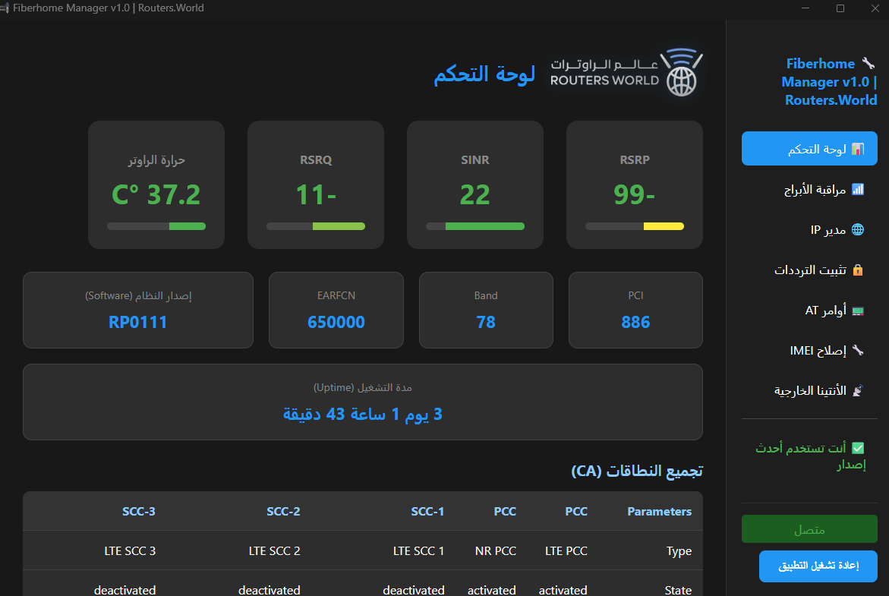

# FiberHome Manager

<p align="center">
  
</p>

<p align="center">
  <strong>Advanced Desktop Management Tool for FiberHome LTE / 5G Routers</strong>
</p>

<p align="center">
  
  
  
  
</p>

---

## Overview

FiberHome Manager is a professional Windows desktop application built for advanced users who require full visibility and control over FiberHome LTE / 5G routers.

The application provides real-time signal analytics, Carrier Aggregation monitoring, neighbor cell inspection, and advanced network control tools through a modern dashboard interface.

> The project is currently distributed as a standalone EXE and is not open source.

---

## Core Features

### Real-Time Signal Analytics
- RSRP
- RSRQ
- SINR
- Device Temperature
- EARFCN / Channel
- Band
- PCI
- Firmware Version
- Uptime

### Carrier Aggregation (CA)
- PCC / SCC monitoring
- LTE & NR aggregation visibility
- Activation state tracking

### Neighbor Cell Monitoring
- Nearby LTE / 5G tower detection
- SINR & RSRP comparison
- EARFCN identification
- Band & PCI mapping
- Signal strength analysis for tower optimization

### Advanced Network Controls
- Band Locking
- AT Command execution
- IMEI management
- IP monitoring
- Automated login/logout handling

---

## Screenshots

### Dashboard


### Carrier Aggregation


### Neighbor Cells Monitoring


---

## Installation

1. Download the latest EXE from the **Releases** section.
2. Run the application.
3. No additional installation required.

---

## Build (Internal Use Only)

```bash
python -m PyInstaller --noconsole --onefile ^
--icon=templates/static/icon.ico ^
--add-data "templates;templates" ^
--distpath ./APP ^
--name "Fiberhome Manager" ^
desktop_app.py
